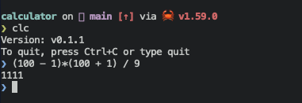

# clc

clc is a Command line calculator written in Rust 🦀



## Install

### Cargo

```shell
cargo install clc
```

### Linux

```shell
curl -sSLf https://github.com/ymgyt/calculator/releases/download/v0.1.1/clc-x86_64-unknown-linux-gnu.tar.gz | tar zxf - -C /usr/local/bin
```

### Mac

```shell
curl -sSLf https://github.com/ymgyt/calculator/releases/download/v0.1.1/clc-x86_64-apple-darwin.tar.gz | tar zxf - -C /usr/local/bin
```

## License

This project is available under the terms of either the [Apache 2.0 license](../LICENSE-APACHE) or the [MIT license](../LICENSE-MIT).
